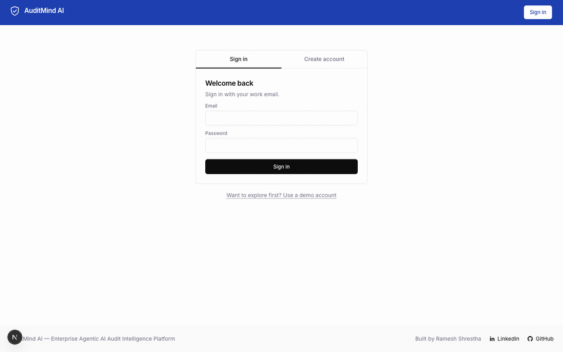
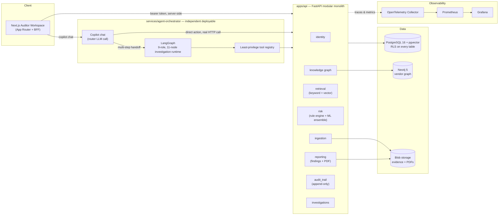
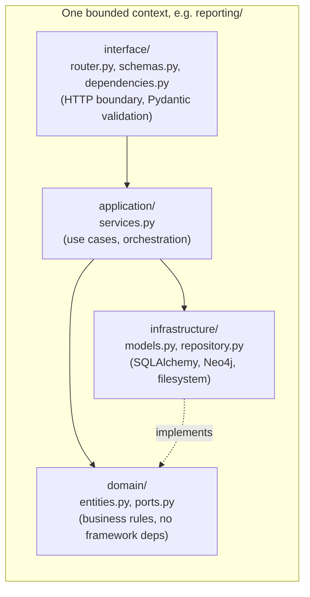
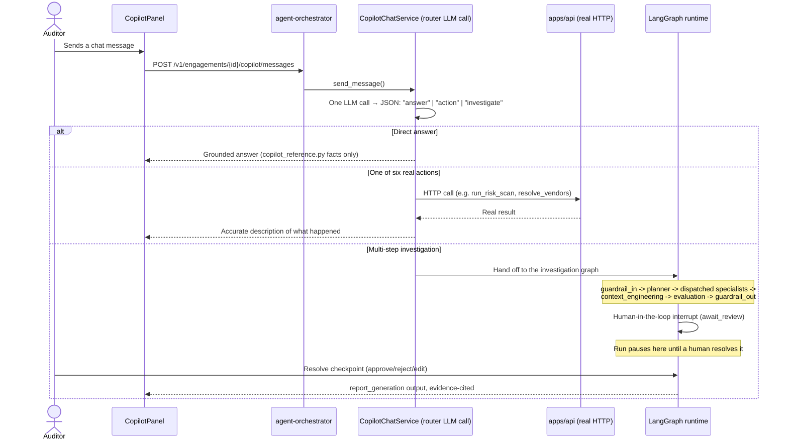
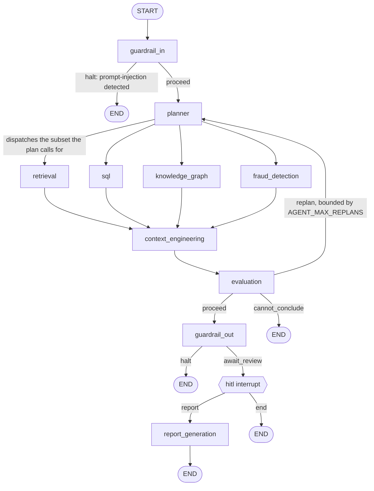
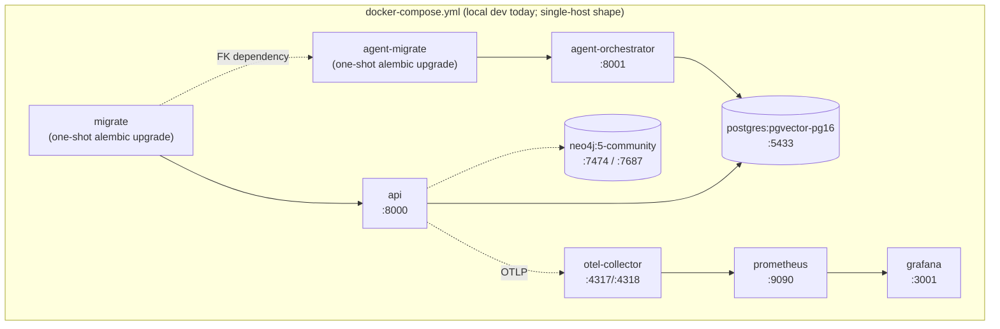

<div align="center">
  
</div>

<div align="center">
  
</div>

<br/>

<div align="center">

**Version:** 0.1.0 &nbsp;·&nbsp; **Status:** Actively developed, pre-production &nbsp;·&nbsp; **Author:** [Ramesh Shrestha](https://github.com/RameshSTA)

[](#4-technology-stack)&nbsp;
[](#4-technology-stack)&nbsp;
[](#5-ai-architecture)&nbsp;
[](#12-database-design)&nbsp;
[](#16-testing)&nbsp;
[](#21-license)

</div>

<br/>

<div align="center">

### 🎬 Live Walkthrough



<sub>Recorded end-to-end against a live local stack (Postgres + Neo4j + FastAPI + LangGraph agent runtime + Next.js) with the checked-in sample engagement — nothing staged.</sub>

</div>

---

<div align="center">

### The Problem

</div>

<div align="justify">

A financial-controls audit generates hundreds of source documents and thousands of ledger
transactions per engagement, and manual workpaper review does not scale with that volume. Most
"AI audit tools" on the market solve this by cutting a corner: either they summarize documents
with no traceable evidence back to source text, or they let an LLM directly assert a finding with
no human gate before it counts. AuditMind AI refuses both shortcuts.

</div>

| Without AuditMind AI | With AuditMind AI |
|---|---|
| Evidence review is manual, page by page, across hundreds of documents | Hybrid keyword + semantic search across every document, cited to an exact source offset |
| Fraud signals hide in thousands of transactions no reviewer can eyeball at scale | A forensic rule engine *and* an ML ensemble score every transaction, cross-validated against its own accuracy |
| "AI audit tools" assert findings with no traceable evidence | Every finding is evidence-cited and requires mandatory human confirm/reject before it counts |
| A chatbot describes what it *would* do | An AI Copilot takes six real backend actions directly, or hands off to a 9-role LangGraph investigation agent |
| Vendor fraud rings hide across differently-formatted vendor names | A Neo4j knowledge graph resolves vendor identity deterministically and exposes the full payment network |

<div align="justify">

**AI can propose, retrieve, and draft — but every artifact that leaves the system as a finding or
report must be explicitly signed off by a person**, and every action the AI takes must be a real,
auditable operation, never a fabricated confirmation. This shows up down to the level of individual
prompts: the AI Copilot's own reference material (`copilot_reference.py`) is written to describe
*only what the platform can currently do*, specifically so the model can never describe a
designed-but-unbuilt feature as if it already shipped.

> **Scope note.** Everything described in this document reflects what is actually implemented and
> verified in this repository today, down to the exact rule thresholds, model hyperparameters, and
> prompt logic. Where something is designed but not yet built, it is called out explicitly — in
> [Future Enhancements](#19-future-enhancements) or inline as a stated gap — rather than glossed
> over. This document does not describe aspirational features.

</div>

---

<div align="justify">

## Table of Contents

1. [Project Overview](#1-project-overview)
2. [Features](#2-features)
3. [System Architecture](#3-system-architecture)
4. [Technology Stack](#4-technology-stack)
5. [AI Architecture](#5-ai-architecture)
6. [Embedding Model](#6-embedding-model)
7. [Vector Database](#7-vector-database)
8. [Retrieval-Augmented Generation (RAG)](#8-retrieval-augmented-generation-rag)
9. [Fraud Detection & the ML Risk Ensemble](#9-fraud-detection--the-ml-risk-ensemble)
10. [Data Pipeline](#10-data-pipeline)
11. [API Documentation](#11-api-documentation)
12. [Database Design](#12-database-design)
13. [Security](#13-security)
14. [Performance](#14-performance)
15. [Deployment](#15-deployment)
16. [Testing](#16-testing)
17. [Architecture Decisions](#17-architecture-decisions)
18. [Challenges & Solutions](#18-challenges--solutions)
19. [Future Enhancements](#19-future-enhancements)
20. [Contributing](#20-contributing)
21. [License](#21-license)
22. [Acknowledgements](#22-acknowledgements)

---

## 1. Project Overview

### What it is

A financial-controls audit generates hundreds of source documents and thousands of ledger
transactions per engagement. AuditMind AI turns that raw pile into a working set an auditor can
actually reason about — evidence is ingested and made searchable two ways (keyword and semantic),
every transaction is scored by a forensic-accounting rule engine *and* an ML ensemble, vendor
identities are resolved into a knowledge graph, and risk findings are drafted with evidence
citations that a human must confirm, edit, or reject before anything reaches a report.

### Why it was built

Manual audit workpaper review does not scale with transaction volume, and most "AI audit tools"
in the market either (a) summarize documents without traceable evidence, or (b) let an LLM
directly assert a finding with no human gate. AuditMind AI is built around a different premise:
**AI can propose, retrieve, and draft — but every artifact that leaves the system as a finding or
report must be explicitly signed off by a person**, and every action the AI takes must be a real,
auditable operation, never a fabricated confirmation. This shows up everywhere in the codebase,
down to the level of individual prompts: the AI Copilot's own reference material
(`copilot_reference.py`) is written to describe *only what the platform can currently do*,
specifically to stop the model from describing designed-but-unbuilt features as if they existed.

### Target users

Internal audit teams, forensic/fraud investigators, and GRC (governance, risk, compliance)
analysts running a financial-controls engagement — the kind of work firms like the Big Four and
internal audit functions at large enterprises perform. The platform models four engagement roles
explicitly in its authorization layer: **Auditor**, **Fraud Analyst**, **Compliance Manager**, and
a fourth, more limited role for read-mostly participants — every role-gated endpoint documented in
this README states exactly which of these can call it.

### Key capabilities

| Capability | Summary |
|---|---|
| Evidence ingestion | Upload, dedupe (content hash), parse, and paragraph-aware chunk documents |
| Hybrid retrieval | Postgres full-text search + pgvector semantic search (two independent legs) |
| Forensic rule engine | Benford's Law leading-digit test, duplicate-payment detection, threshold/round-dollar structuring — real forensic-accounting heuristics, not placeholder checks |
| ML fraud ensemble | Isolation Forest + HDBSCAN cohort clustering + vendor-tenure graph centrality, combined by a fixed weighted-linear formula |
| Model validation | A dedicated endpoint that cross-validates the ML signals (5-fold stratified k-fold, bootstrap cluster-stability, ablation of the combiner's own weights) — the platform measures its own model's separative power, not just its output |
| Knowledge graph | Neo4j vendor entity resolution via Unicode-normalized exact matching across documents and transactions |
| Findings & reporting | Evidence-cited findings, mandatory human confirm/reject, Markdown + PDF export |
| AI Copilot | One router LLM call per message → grounded direct answer, a real backend action, or a hand-off to the investigation agent |
| Investigation agent | A 9-role, 11-node LangGraph state machine with an input guardrail, an LLM-as-judge groundedness evaluator, an output guardrail, and a human-in-the-loop interrupt |
| Audit trail | Append-only log with no `UPDATE`/`DELETE` grant at the database level |
| Observability | OpenTelemetry traces/metrics, Prometheus, Grafana, out of the box in local dev |

### Business and technical value

- **Business value:** shrinks the time between "evidence lands in the engagement" and "a
  defensible, evidence-linked finding exists," while keeping a human in the loop on every
  disposition — auditability of the AI's own actions is a first-class design goal, not an
  afterthought. The platform is also honest about the limits of its own ML signals: the
  model-validation endpoint and its ablation study exist specifically so a firm adopting this
  platform doesn't have to take the fraud-scoring ensemble's competence on faith.
- **Technical value:** demonstrates a production-shaped agentic AI system — bounded contexts, Row-
  Level Security enforced by the database rather than application code, a real (not mocked) RAG
  pipeline, an actual ML ensemble with documented hyperparameters and a self-validation endpoint
  (not a rules-only "fraud detector" wearing an ML label), and an agent runtime that is a genuine
  state machine with explicit tool-call boundaries and two separate guardrail checkpoints, not a
  single unconstrained LLM loop.

---

## 2. Features

### Core Features

- Document upload with SHA-256 content-hash deduplication, parsing, and paragraph-aware chunking
- Transaction import and a three-rule forensic-accounting anomaly scanner (see [Section 9](#9-fraud-detection--the-ml-risk-ensemble))
- Evidence-cited finding drafting with mandatory confirm/reject/edit human sign-off
- Markdown and PDF report generation from confirmed findings only
- Append-only audit trail (no `UPDATE`/`DELETE` grant at the database level)
- Investigation case workspace (gather evidence → draft → human sign-off)

### AI Features

- Hybrid retrieval: Postgres full-text search (keyword) and pgvector similarity search (semantic), as two independent endpoints
- ML fraud-scoring ensemble: Isolation Forest (`contamination="auto"`) + HDBSCAN (`min_cluster_size=5`) cohort clustering + vendor-tenure graph centrality, combined by fixed weights (`0.40 / 0.30 / 0.15 / 0.15`)
- A dedicated model-validation endpoint: 5-fold stratified cross-validation, bootstrap cluster-stability analysis, and a per-signal ablation study
- Neo4j knowledge graph for vendor entity resolution via Unicode (NFKC) normalization + case-folding — no fuzzy matching, a deterministic canonical key per vendor
- AI Copilot: one router LLM call per chat message → direct answer, one of six real backend actions, or a hand-off to the investigation agent
- A 9-role, 11-node LangGraph investigation runtime: input guardrail → planner → a dispatched subset of four evidence specialists → context engineering → LLM-as-judge evaluator → output guardrail → human-in-the-loop interrupt → report generation
- Least-privilege tool registry: every agent role is mapped to the exact tools it may call, denying anything not explicitly listed

### User Features

- Self-service sign-up/sign-in with role selection and just-in-time engagement provisioning
- Keyboard-first command palette (<kbd>⌘</kbd>/<kbd>Ctrl</kbd>+<kbd>K</kbd>) sharing one navigation source of truth with the sidebar
- Risk, Fraud Detection, Knowledge Graph, Findings, Reports, Investigations, Monitoring, Evaluation, and Copilot workspaces
- Toast confirmations for non-destructive actions, modal confirmations for mutations that need one

### Security Features

- Row-Level Security on every engagement-scoped Postgres table, enforced by the database, not application code
- Dedicated least-privilege `auditmind_app` database role — the application never connects as a superuser
- OIDC (Entra ID) authentication with RS256 JWT validation against a JWKS endpoint
- Two-layer authorization: coarse role check from the JWT, fine-grained engagement membership re-checked against the database on every request (JWT claims are never trusted for membership)
- Server-side BFF: bearer tokens never reach the browser

### Performance Features

- Async I/O throughout the backend (FastAPI + SQLAlchemy 2.0 async + asyncpg)
- Embedding inference offloaded to a thread pool so it never blocks the event loop
- Idempotent embedding and risk-scoring endpoints (`ON CONFLICT DO NOTHING` upserts) safe to re-run
- Query-time HNSW recall/latency tuning (`ef_search`) on vector similarity search
- Cached JWKS signing keys (60-minute TTL) instead of a network round-trip per request

### Developer Features

- Hexagonal layering (`domain → application → infrastructure → interface`) enforced one-directionally by `import-linter` in CI, not just convention
- `ruff` linting, `mypy --strict` type-checking, and pre-commit hooks across both Python services
- Two independent CI pipelines (`apps/api`, `services/agent-orchestrator`), each running lint → type-check → unit tests → integration tests → Docker build
- One-command local dev bootstrap (`make dev`) and a bundled sample dataset (`make seed-sample`) for demoing without real client data

---

## 3. System Architecture

### High-Level Architecture



### Component Architecture

`apps/api` is one FastAPI deployable containing eight bounded contexts. Every context follows the
same internal layering:



`import-linter` enforces this one-directionally in CI: `domain` cannot import `infrastructure` or
`interface`; one context cannot reach into another context's internals. One acknowledged exception
exists by design, not oversight: `reporting`, `risk`, and `investigations` each carry their own
byte-identical `PostgresAuditTrailRecorder` implementation in their own `infrastructure/` layer,
rather than importing a shared one from `audit_trail` — the duplication is the price paid to keep
every context's dependency graph free of a cross-context import, and is treated as an acceptable,
intentional trade-off, not dead code to consolidate.

### Request Lifecycle

```mermaid
sequenceDiagram
    actor Auditor
    participant Web as Next.js UI
    participant BFF as Next.js BFF (route handler)
    participant API as apps/api (FastAPI)
    participant PG as PostgreSQL (RLS)

    Auditor->>Web: Interacts with a panel (e.g. confirm finding)
    Web->>BFF: fetch (same-origin, session cookie)
    BFF->>BFF: Attach caller's bearer token (server-side only)
    BFF->>API: HTTP request with Authorization header
    API->>API: Validate JWT (RS256, JWKS) — shared/auth.py
    API->>API: require_engagement_member() — re-check membership in DB
    API->>PG: SET app.current_user_id; run query
    PG-->>API: RLS-filtered rows only
    API-->>BFF: JSON response
    BFF-->>Web: JSON response
    Web-->>Auditor: Updated UI
```

### AI Copilot / Investigation Flow



### The Investigation Graph, in Full

The 9 `AgentRole` values (`planner`, `retrieval`, `sql`, `knowledge_graph`, `fraud_detection`,
`report_generation`, `context_engineering`, `evaluation`, `guardrail`) are compiled into an
11-node LangGraph `StateGraph` — `guardrail` runs twice (once as an input filter, once as an
output filter) and the human-in-the-loop interrupt is a graph checkpoint, not a distinct agent
role:



**Honest gap:** the `sql` node's system prompt instructs it to "select a parameterized query
template and bind its parameters, never author raw SQL" — but no backing endpoint in `apps/api`
currently executes such a template. It is a wired graph node with no live tool behind it yet.

### Backend Architecture

FastAPI + SQLAlchemy 2.0 (async) + Alembic, organized as eight bounded contexts under
`apps/api/src/auditmind_api/`: `identity`, `ingestion`, `retrieval`, `risk`, `kg` (knowledge
graph), `reporting`, `audit_trail`, `investigations`, plus a `shared/` kernel (settings, auth,
logging, metrics, Neo4j client, ORM base, roles).

### Frontend Architecture

Next.js 15 App Router. Route handlers under `apps/web/src/app/api/bff/` form a Backend-for-Frontend
layer — the browser only ever talks to same-origin BFF routes; the BFF holds the bearer token and
proxies to `apps/api` and `services/agent-orchestrator`. Data fetching uses TanStack Query;
styling uses Tailwind CSS with a small custom design-token layer.

### Database Architecture

A single PostgreSQL 16 instance (with the `pgvector` extension) hosts every bounded context's
tables, each in its own schema (`identity.*`, `ingestion.*`, `retrieval.*`, `reporting.*`, etc.).
Every engagement-scoped table carries `engagement_id` and a Row-Level Security policy — isolation
is a database guarantee. Neo4j hosts the vendor knowledge graph separately (no RLS available
there; isolation is enforced in application code).

### Deployment Architecture



No cloud infrastructure-as-code (Terraform, Bicep, or Kubernetes manifests) exists in this
repository yet — see [Future Enhancements](#19-future-enhancements). Today's deployment target is
Docker Compose on a single host.

### Security Architecture

Covered in full in [Section 13 — Security](#13-security).

### Monitoring Architecture

`shared/logging.py` configures `structlog` to emit one JSON object per line to stdout, with
`trace_id`/`engagement_id`/`run_id` bound via context variables. `shared/metrics.py` defines four
OpenTelemetry counters (`auditmind.documents_ingested_total`,
`auditmind.findings_created_total`, `auditmind.anomalies_detected_total`,
`auditmind.risk_scores_computed_total`), incremented from the composition root. Auto-instrumentation
covers FastAPI, SQLAlchemy, and outbound `httpx` calls. Everything is exported via OTLP gRPC to an
OpenTelemetry Collector, which remote-writes metrics into Prometheus; Grafana ships with a
pre-provisioned datasource and dashboard.

---

## 4. Technology Stack

| Technology | Purpose | Why Selected | Benefits |
|---|---|---|---|
| **FastAPI** 0.115 | Backend web framework (both `apps/api` and `services/agent-orchestrator`) | Async-native, Pydantic-integrated request validation, automatic OpenAPI generation | Low-boilerplate typed endpoints; dependency-injection system maps cleanly onto RBAC/RLS checks |
| **SQLAlchemy** 2.0 (async) + **asyncpg** | ORM / database access | Mature migration story via Alembic; async engine avoids blocking the event loop on I/O | Typed models, connection pooling, one query style across all bounded contexts |
| **Alembic** | Schema migrations | Standard SQLAlchemy migration tool; each service keeps its own independent migration history | Reproducible schema evolution, RLS policies and grants versioned alongside tables |
| **PostgreSQL** 16 + **pgvector** | Relational data + vector similarity search | One database serves transactional data, Row-Level Security, full-text search, *and* vector search — no separate vector store to operate | Native RLS for tenant isolation; `pgvector`'s HNSW index gives approximate nearest-neighbor search without a second system |
| **Neo4j** 5 (Community) | Knowledge graph (vendor entity resolution) | Native graph traversal and relationship queries are a poor fit for a relational schema | Fast multi-hop vendor/transaction network queries; Cypher is purpose-built for this |
| **LangGraph** 0.6 | Multi-step investigation agent runtime | Gives an explicit state machine (nodes, edges, interrupts) over agent steps instead of an unconstrained loop | Deterministic control flow, resumable checkpoints, a real human-in-the-loop interrupt primitive |
| **LiteLLM** 1.77 | LLM provider gateway | One client interface across model providers (Anthropic, OpenAI, etc.) via config, not code changes | Swapping models is a config edit, not a redeploy |
| **scikit-learn**, **HDBSCAN**, **sentence-transformers** (BAAI/bge-m3) | ML fraud ensemble + embeddings | Mature, well-understood algorithms; no managed ML service dependency; BGE-M3 is a strong open-weight multilingual embedding model | Runs entirely in-process, CPU-only, no external ML API cost or latency |
| **fpdf2** | PDF report generation | Pure Python — no headless-browser (Chromium/Pango/Cairo) dependency in the container | Small image size, fast, deterministic rendering |
| **Next.js** 15 (App Router) + **React** 19 | Frontend framework | Route handlers double as a server-side BFF; React Server/Client Component split fits the auth model | Bearer tokens never reach the browser; file-based routing keeps the app shell simple |
| **TanStack Query** 5 | Client-side data fetching/caching | De-facto standard for server-state management in React | Automatic caching, refetching, and loading/error states without hand-rolled logic |
| **Tailwind CSS** 3 | Styling | Utility-first, keeps a near-monochrome design system consistent across ~15 panels | No component-library lock-in; design tokens live in one config file |
| **python-jose** | JWT validation | RS256 verification against a JWKS endpoint (OIDC standard) | Interoperates directly with Entra ID without a bespoke session store |
| **structlog** | Structured logging | JSON-line output pairs directly with log aggregation and the OTel pipeline | Context (trace/engagement/run id) is bound once and carried through every log line |
| **OpenTelemetry** + **Prometheus** + **Grafana** | Observability | OTLP is vendor-neutral; Prometheus remote-write supports dynamic scaling (push, not pull) | One Collector is the single fan-out point — services never talk to Prometheus/Grafana directly |
| **Docker Compose** | Local orchestration | Single-host, one-command bootstrap for a multi-service stack (2 databases, 2 APIs, 3 observability services) | Reproducible dev environment; `migrate`/`agent-migrate` one-shot services guarantee schema-before-app ordering |
| **Ruff**, **mypy --strict**, **import-linter** | Static analysis | Fast linting, strict typing, and layering enforcement, all run in CI | Catches boundary violations and type errors before review, not after |

**Alternatives considered and not chosen:** a dedicated vector database (Pinecone, Weaviate,
Qdrant) was passed over in favor of `pgvector` — running one fewer stateful system outweighs
their more advanced ANN indexing at this data scale. A managed LLM orchestration framework
(LangChain agents) was passed over in favor of hand-written LangGraph nodes — an explicit state
machine is easier to reason about and test deterministically than an agent loop with implicit
control flow. `langchain-core` is a direct dependency only for its `RunnableConfig` type
(`application/orchestrator.py`) — the actual model calls never go through a LangChain `ChatModel`
wrapper; they go through LiteLLM directly, per ADR-005 (see [Section 17](#17-architecture-decisions)).

---

## 5. AI Architecture

### Large Language Model

Model access goes through **LiteLLM**, configured in `services/agent-orchestrator/config/litellm.yaml`
and selected via the `AGENT_DEFAULT_MODEL` setting (default alias: `claude-primary`). This keeps
the agent code provider-agnostic — switching models or providers is a config change, not a code
change. The provider API key (e.g. `OPENAI_API_KEY`) is read directly by LiteLLM from the process
environment and is deliberately **not** surfaced through the service's own `Settings` object, so
it is never accidentally logged. Every LLM call in the graph uses the same client
(`LlmClient.complete`) with the configured model and a `max_tokens` ceiling of 1024 — there is no
per-node model or token-budget variation today.

### Prompt Engineering

Prompts are short, role-scoped system instructions, not long few-shot exemplar chains. A
representative sample, paraphrased from the actual node implementations
(`application/nodes.py`):

| Node | System prompt's core instruction |
|---|---|
| `planner` | "Decompose the task into sub-tasks, assign each to a specialist agent, and record their dependency order. Never gather evidence yourself." |
| `retrieval` | "Answer only from the provided passages. If no passage supports an answer, say so explicitly — never answer from prior knowledge." |
| `knowledge_graph` | "Answer relationship questions from graph facts using a parameterized traversal template." |
| `fraud_detection` | "Triage and explain pre-computed anomaly signals — you never compute a fraud score yourself." |
| `sql` | "Select a parameterized query template and bind its parameters. Never author raw SQL." |
| `evaluation` | "Judge whether the narrative directly and specifically answers the task using only what is actually stated in it — never reward speculation or generic language. Respond with ONLY a number from 0.0 to 1.0." |

Two design choices recur across every node: (1) each specialist is explicitly told what it is
*not* allowed to do (the retrieval agent cannot answer from "prior knowledge," the fraud-detection
agent cannot compute its own score) — the prompt enforces the same tool-boundary the tool
registry enforces programmatically; (2) the evaluator's prompt asks for a bare number, not prose,
specifically so the response can be parsed deterministically (a regex extracts the first
floating-point number, clamps it to `[0.0, 1.0]`, and **fails closed to `0.0`** if nothing
parses — an unparseable evaluation is treated as "not grounded," never silently ignored).

### System Prompt & Grounding

The Copilot's direct-answer path is grounded in `copilot_reference.py` — a hand-authored,
continuously updated description of the platform's *actual* current capabilities. Representative
lines, quoted directly from that file:

> "Documents & Evidence: upload a document (any engagement member can), generate semantic
> embeddings for it, then keyword or semantic search across all uploaded evidence."
>
> "Findings: draft a finding (Auditor, FraudAnalyst, or ComplianceManager can draft); an Auditor
> or FraudAnalyst must then confirm or reject it — every finding requires this human sign-off
> before it counts for anything."
>
> "Risk & Anomalies: paste/import transactions, run the rule-engine anomaly scan (Benford's Law
> deviation, duplicate-payment matching, threshold/round-dollar detection), compute the ML risk
> score ensemble (Isolation Forest + HDBSCAN cohort clustering + graph centrality), and confirm or
> dismiss each flagged anomaly."

This exists to solve a specific, observed failure mode: an LLM asked "what can you do?" will
happily describe designed-but-unbuilt roadmap features as if they already ship. Grounding the
answer path in a hand-maintained, accurate capability list closes that gap.

### Few-Shot Prompting & Chain of Thought

**Not used, by design.** No node's prompt includes few-shot exemplars or an explicit
chain-of-thought scratchpad. The reasoning structure comes from the *graph* itself — decomposing a
task into a plan, dispatching bounded specialists, and running a separate evaluator call — rather
than from asking one model call to reason step-by-step internally. This is a deliberate
architectural choice: a wrong intermediate step is visible and correctable at a node boundary,
where an internal chain-of-thought is not.

### Tool Calling & the Least-Privilege Tool Registry

Every tool a node can call is gated by a static `(tool, role)` registry
(`application/tool_registry.py`) — a role attempting to call a tool it isn't listed for is denied
before the call reaches any backing API. Concrete entries from the actual registry:

| Tool | Allowed role(s) | Write? |
|---|---|---|
| `hybrid_search` | `retrieval` only | No |
| `graph_traverse` | `knowledge_graph` only | No |
| `get_anomaly_cluster` | `fraud_detection` only | No |
| `get_confirmed_findings` | `report_generation` only | No |
| `submit_finding_draft` | `retrieval`, `sql`, `knowledge_graph`, `fraud_detection` | **Yes** |
| `import_transactions`, `run_risk_scan`, `compute_risk_scores`, `resolve_vendors`, `generate_report`, `generate_embeddings` | `copilot_actions` only | **Yes** |

The Copilot's direct-action dispatcher (`copilot_actions`) is deliberately the *only* role
authorized for the six data-mutating actions a chat message can trigger directly — no investigation
specialist can call `run_risk_scan` itself, only draft a finding referencing what the rule engine
already found.

### Agent Architecture

Two distinct agent surfaces exist, deliberately separated by responsibility:

1. **`CopilotChatService`** — a lightweight conversational layer. One router LLM call per user
   message returns a single JSON decision among three outcomes: `"answer"` (respond directly,
   grounded in `copilot_reference.py`), `"action"` (invoke exactly one of the six real backend
   actions above), or `"investigate"` (hand off to the full investigation graph, for a request
   that needs multi-step evidence gathering or could produce a finding requiring sign-off). If the
   model's response isn't valid JSON, the router falls back to the `"answer"` path rather than
   guessing at an action.
2. **The LangGraph investigation runtime** — the 9-role, 11-node state machine described in
   [Section 3](#3-system-architecture): an input guardrail, a planner, a dispatched subset of
   four evidence specialists (`retrieval`, `sql`, `knowledge_graph`, `fraud_detection`), a
   `context_engineering` node that assembles their output into one evidence context, an
   `evaluation` node, an output guardrail, a human-in-the-loop interrupt, and a final
   `report_generation` node.

### Memory

Conversational history for the Copilot is persisted per-user, per-engagement in `agent.messages`
(Row-Level Security scoped to `user_id`, so a teammate's conversation is never visible to another
user). The LangGraph runtime's own state is checkpointed per run — see the honest caveat on
checkpoint durability in [Section 19](#19-future-enhancements): the checkpointer is in-memory
today, not the durable `AsyncPostgresSaver` the dependency is already pinned for.

### Planning & Reasoning

The `planner` node produces the initial plan and decides which of the four specialists the task
actually needs — it never dispatches all four unconditionally. A bounded re-plan ceiling
(`AGENT_MAX_REPLANS`, default 2) caps how many times the `evaluation` node can send the run back
to `planner` for revision before the graph gives up with `cannot_conclude` rather than looping
indefinitely.

### Reflection & Evaluation

The `evaluation` node is a genuine second, independent LLM call — not a heuristic — scoring
whether `context_engineering`'s assembled evidence actually and specifically supports the task, on
a `0.0`–`1.0` scale, using only what the evidence states. An empty context short-circuits to
`0.0` without spending a model call. This groundedness check runs on the assembled evidence before
the *final* answer is produced — it gates whether the run proceeds to the output guardrail, replans,
or gives up, not a post-hoc audit of an already-delivered answer.

### Knowledge Retrieval, Context Injection & Response Generation

Evidence specialists call the same underlying capabilities the UI itself uses — hybrid search,
graph traversal, anomaly/risk lookups — through the tool registry above, so each node's authority
never exceeds what its role is explicitly granted. `context_engineering` is the seam where each
specialist's raw output (search passages, graph facts, anomaly/risk data) is assembled into one
coherent evidence context before the evaluator scores it and, eventually, `report_generation`
writes the final, evidence-cited narrative. The agent runtime never writes directly into the
`findings` table itself — a human confirms the output into a real Finding through `apps/api`'s own
reporting endpoints.

---

## 6. Embedding Model

| Property | Value |
|---|---|
| Model | `BAAI/bge-m3` (via `sentence-transformers`) |
| Embedding dimensions | 1024 (fixed; stored as `vector(1024)` in pgvector) |
| Inference location | In-process, CPU-only (no GPU dependency, no external embedding API) |
| Concurrency handling | Offloaded to a thread pool (`anyio.to_thread.run_sync`) so embedding inference never blocks the FastAPI event loop |
| Normalization | Embeddings are L2-normalized at generation time (`normalize_embeddings=True`) |

**Chunking strategy** (`ingestion/application/chunking.py`): paragraph-based, not fixed-size —
blank-line-delimited paragraphs are the primary split boundary and are never broken up unless they
exceed the word budget:

- **Target size:** 375 words per chunk (chosen to approximate roughly 500 tokens at a ~0.75
  tokens-per-word rule of thumb)
- **Minimum size:** 40 words — a trailing fragment below this is merged into its predecessor
  rather than indexed alone
- **Overlap:** 12% of the target word count, applied only when an oversized paragraph must be
  split internally
- **Character offsets:** exact for untouched paragraphs; approximate for paragraphs that were
  split

**Why this approach:** paragraph boundaries are natural semantic units in audit documents
(policies, contracts, memos); a pure fixed-token sliding window would routinely cut sentences and
clauses mid-thought, which is exactly what evidence citations cannot afford to do.

**Alternatives considered:** naive fixed-token chunking (rejected — worse citation quality),
sentence-window chunking (rejected — more complex than needed for structured audit documents at
current scale). **Cost/latency:** embedding runs synchronously with the request today (see
[Section 19](#19-future-enhancements) for the deferred async-batch design). **Trade-off:** no OCR
support yet — image-only PDFs are not text-extractable.

---

## 7. Vector Database

`pgvector` runs inside the same PostgreSQL instance as every other table — there is no separate
vector database process to operate.

**Why a vector store is needed:** keyword search alone misses paraphrased or conceptually related
evidence ("segregation of duties" vs. "one person shouldn't approve and pay the same invoice");
semantic similarity search closes that gap.

**Similarity search implementation** (`retrieval/infrastructure` embedding index):

```sql
SELECT c.id, c.document_id, c.engagement_id, c.text,
       1 - (e.embedding <=> CAST(:query_embedding AS vector)) AS similarity
FROM retrieval.chunk_embeddings e
JOIN ingestion.chunks c ON c.id = e.chunk_id
WHERE e.engagement_id = :engagement_id AND e.model_id = :model_id
ORDER BY e.embedding <=> CAST(:query_embedding AS vector)
LIMIT :limit
```

- **Distance operator:** `<=>` (pgvector's HNSW-indexed distance operator); reported similarity is
  `1 - distance`.
- **Index tuning:** `SET LOCAL hnsw.ef_search = 40` biases the query toward interactive-search
  latency over maximum recall.
- **Storage key:** composite primary key `(chunk_id, model_id)` — re-embedding with a new model
  adds new rows rather than overwriting old vectors, so a model upgrade doesn't require a
  synchronized cutover.
- **Retrieval:** top-K only (`limit`, 1–100, default 20); no metadata pre-filtering beyond
  `engagement_id` and `model_id` today.

**Keyword leg** (separate endpoint, Postgres full-text search):

```sql
SELECT id, document_id, engagement_id, text,
       ts_rank_cd(search_vector, websearch_to_tsquery('english', :query)) AS rank
FROM ingestion.chunks
WHERE engagement_id = :engagement_id
  AND search_vector @@ websearch_to_tsquery('english', :query)
ORDER BY rank DESC
LIMIT :limit
```

**On hybrid search:** the keyword and semantic legs are currently **two independent, unfused
endpoints** (`GET /search` and `GET /search/semantic`) — there is no reciprocal-rank-fusion or
weighted combination of the two scores yet. This is a stated, deliberate gap, not an oversight;
see [Future Enhancements](#19-future-enhancements).

**Why `pgvector` over a dedicated vector database** (Pinecone, Weaviate, Qdrant, FAISS): at this
engagement's data scale, operating one fewer stateful service outweighs the more advanced
ANN-indexing options a dedicated vector database would offer, and transactional consistency
between a chunk's metadata and its embedding comes for free in the same database and the same
Row-Level Security policy.

---

## 8. Retrieval-Augmented Generation (RAG)

**Offline / ingestion pipeline:** document upload → SHA-256 content-hash dedup check → parse (text
extraction) → paragraph-aware chunking → chunk rows written to `ingestion.chunks` (with a
generated `tsvector` column for keyword search) → a separate, explicit embedding step
(`POST .../documents/{id}/embeddings`) generates and stores vectors in `retrieval.chunk_embeddings`.
Embedding is **not** automatic on upload — it is its own idempotent operation, callable by a user
action, the Copilot, or the investigation agent.

**Online / query pipeline:** a query hits either the keyword endpoint or the semantic endpoint
(not both, today); results are chunks with a relevance/similarity score, `document_id`, and
character offsets, which the caller (UI, Copilot, or agent) uses to build citations back to
source text.

**Advantages:** two genuinely independent retrieval legs with different failure modes (keyword
handles exact terminology; semantic handles paraphrase); citations are exact-offset back to source
documents, not paraphrased summaries.

**Limitations:** no OCR (scanned/image-only PDFs aren't searchable), no re-ranking step, no fused
hybrid scoring, embedding runs synchronously rather than as a background job.

**Future improvements:** see [Section 19](#19-future-enhancements).

---

## 9. Fraud Detection & the ML Risk Ensemble

This is one of the platform's most concrete, verifiable subsystems — every threshold and weight
below is quoted directly from `apps/api/src/auditmind_api/risk/application/`.

### The rule engine (`rules.py`) — three forensic-accounting heuristics

**1. Benford's Law leading-digit test.** Computes the Mean Absolute Deviation between each
transaction population's observed leading-digit distribution and Benford's expected
logarithmic distribution:

```
MAD = Σ |observed_freq(d)/n − log₁₀(1 + 1/d)|  for d in 1..9,  divided by 9
```

- **Minimum sample size:** 50 transactions — an explicitly documented simplification; the
  original Nigrini methodology recommends 300+ for a reliable first-digit test, noted as such in
  the code's own comments.
- **Thresholds:** `MAD < 0.012` → no anomaly; `0.012 ≤ MAD < 0.015` → **MEDIUM** severity;
  `MAD ≥ 0.015` → **HIGH** severity.

**2. Duplicate-payment detection.** Matches transactions by normalized (trimmed, case-folded)
exact vendor-name equality within a proximity window (default 3 days). Same-day duplicates are
**HIGH** severity; duplicates within the 3-day window are **MEDIUM**. This is exact-match, not
fuzzy/edit-distance matching.

**3. Threshold structuring & round-dollar detection.** Flags amounts just below a $10,000
structuring threshold (the $9,500–$9,999 band) as **HIGH** severity, and flags round-thousand
amounts (multiples of $1,000, ≥ $1,000) as **LOW** severity — the classic "kept it under the
reporting threshold" and "round numbers are suspicious in real invoicing data" heuristics.

### The ML ensemble (`ml_signals.py`, `combiner.py`) — three learned signals

| Signal | Algorithm & hyperparameters | Minimum sample size | Output |
|---|---|---|---|
| Isolation Forest | `contamination="auto"`, `random_state=42` | 10 transactions | Min-max normalized to `[0, 100]`, higher = more anomalous |
| HDBSCAN cohort clustering | `min_cluster_size=5` | 10 transactions | Boolean noise flag (`label == -1` = doesn't fit any cohort) |
| Vendor-tenure graph centrality | `100.0 × (1 − min(vendor_txn_count, 10) / 10)` | — | 100 for a brand-new one-off vendor, scaling to 0 once a vendor has 10+ transactions |

Below the 10-transaction floor, Isolation Forest and HDBSCAN both return an empty signal rather
than a fabricated score — the combiner renormalizes around whatever signals are actually present.

### The combiner — fixed weighted-linear formula

```python
_WEIGHTS = {
    "rule_engine": 0.40,
    "isolation_forest": 0.30,
    "hdbscan_cohort": 0.15,
    "graph_centrality": 0.15,
}
final_score = Σ(weight × signal_value) / Σ(weight for signals actually present)
```

Weighted-*linear*, not weighted-logistic, by deliberate choice — documented in the code as: "an
auditor can reweight per engagement and understand exactly what changed" with a linear model in a
way a logistic one obscures. **Per-engagement reweighting is not implemented** — the weights above
are fixed constants today, a stated, acknowledged gap, not a hidden one.

### Model validation (`GET /v1/engagements/{id}/risk/model-validation`)

The platform validates its own ML signals rather than only reporting their output:

- **Cross-validation:** 5-fold stratified k-fold (`StratifiedKFold`, `shuffle=True`,
  `random_state=42`) reporting ROC-AUC mean/std, precision@p90, and recall@p90 for the Isolation
  Forest signal.
- **Cluster-stability analysis:** 15 bootstrap resamples of HDBSCAN, reporting noise-fraction
  mean/std and cluster-count mean/std.
- **Combiner ablation:** each signal's weight is independently zeroed and the remaining weights
  renormalized, then the combined ROC-AUC is recomputed — reporting the delta versus the
  full-ensemble baseline, so it's visible exactly how much each signal actually contributes.
- **The ground-truth caveat, stated honestly:** there is no independently labeled fraud ground
  truth in this demo dataset. Every metric above uses the rule engine's own flagged anomalies as a
  proxy positive label. A strong ROC-AUC here is evidence the ML signals *agree with the rule
  engine's notion of anomalous* — internal ensemble consistency — not proof of real-world
  fraud-detection accuracy against unseen fraud patterns.

### Vendor entity resolution (`kg` context)

Matching is **deterministic normalization, not fuzzy matching**:

```python
def normalize_vendor_name(raw_name: str) -> str:
    return unicodedata.normalize("NFKC", raw_name).strip().casefold()
```

Every transaction's vendor name is normalized to this canonical key; all transactions sharing a
key resolve to one vendor node in Neo4j (`MERGE`, so re-running is idempotent). The *first*
transaction's original spelling becomes the display name — deterministic, so re-running the
resolution never changes which spelling is shown. "Acme Inc.", "ACME INC", and "acme inc" all
resolve to the same vendor; "Acme Incorporated" would not, since normalization does not strip or
expand legal-entity suffixes. This is a stated trade-off: correctness and predictability over
fuzzy-match recall.

---

## 10. Data Pipeline

1. **Ingestion:** upload → content-hash dedup → parse → chunk (see [Section 6](#6-embedding-model))
2. **Validation:** upload size checked against `AUDITMIND_MAX_UPLOAD_SIZE_BYTES` before the file is
   read into memory; every request body is validated by Pydantic schemas at the interface layer
3. **Transformation:** paragraph-aware chunking with character-offset tracking
4. **Embedding generation:** explicit, idempotent, per-document endpoint (BGE-M3, CPU, thread-pooled)
5. **Storage:** Postgres (`ingestion.chunks`, `retrieval.chunk_embeddings`), Neo4j (resolved vendor
   entities), filesystem blob storage (`AUDITMIND_BLOB_STORAGE_ROOT`) for original files and
   generated PDFs
6. **Retrieval:** keyword and semantic search endpoints, engagement-scoped by RLS
7. **Caching:** JWKS signing keys (60-minute TTL); no data-layer cache beyond Postgres's own
   connection pooling and query planning
8. **Monitoring:** OpenTelemetry counters increment on ingestion, finding creation, anomaly
   detection, and risk scoring (see [Section 3 — Monitoring Architecture](#3-system-architecture))

---

## 11. API Documentation

All endpoints are versioned under `/v1`. Every route (except `/healthz`) requires a valid bearer
token; every engagement-scoped route additionally requires active membership on that engagement,
re-checked against the database on every request (see [Section 13](#13-security)).

### `apps/api` — Identity

| Method | Path | Description |
|---|---|---|
| `POST` | `/v1/auth/register` | Self-service signup (201) |
| `POST` | `/v1/auth/login` | Email/password sign-in |
| `GET` | `/v1/me` | Current caller's identity (subject, roles, tenant) |
| `GET` | `/v1/me/engagements` | Caller's engagement memberships |
| `GET` | `/v1/engagements/{engagement_id}` | Engagement name + caller's role |
| `GET` | `/v1/engagements/{engagement_id}/membership` | Caller's role on this engagement |
| `GET` | `/v1/engagements/{engagement_id}/members` | Full member roster |

### `apps/api` — Ingestion

| Method | Path | Description |
|---|---|---|
| `POST` | `/v1/engagements/{engagement_id}/documents` | Upload a document (201) |
| `GET` | `/v1/engagements/{engagement_id}/documents` | List documents |
| `GET` | `/v1/engagements/{engagement_id}/documents/{document_id}/chunks` | List a document's chunks with offsets |

### `apps/api` — Retrieval

| Method | Path | Description |
|---|---|---|
| `GET` | `/v1/engagements/{engagement_id}/search` | Keyword (full-text) search |
| `GET` | `/v1/engagements/{engagement_id}/search/semantic` | Vector similarity search |
| `POST` | `/v1/engagements/{engagement_id}/documents/{document_id}/embeddings` | Generate embeddings for a document (201, idempotent) |

### `apps/api` — Risk

| Method | Path | Description |
|---|---|---|
| `POST` | `/v1/engagements/{engagement_id}/transactions` | Bulk-import transactions (201) |
| `GET` | `/v1/engagements/{engagement_id}/transactions` | List transactions |
| `POST` | `/v1/engagements/{engagement_id}/risk/scan` | Run the 3-rule engine (201, idempotent) |
| `GET` | `/v1/engagements/{engagement_id}/anomalies` | List anomalies |
| `GET` | `/v1/engagements/{engagement_id}/anomalies/{anomaly_id}` | One anomaly |
| `POST` | `/v1/engagements/{engagement_id}/anomalies/{anomaly_id}/disposition` | Set anomaly status (Auditor/Fraud Analyst only) |
| `POST` | `/v1/engagements/{engagement_id}/risk/score` | Run the ML ensemble (201, idempotent) |
| `GET` | `/v1/engagements/{engagement_id}/risk-scores` | List risk scores |
| `GET` | `/v1/engagements/{engagement_id}/risk/model-validation` | Cross-validated model metrics — ROC-AUC, precision/recall@p90, cluster stability, per-signal ablation (see [Section 9](#9-fraud-detection--the-ml-risk-ensemble)) |

### `apps/api` — Knowledge Graph

| Method | Path | Description |
|---|---|---|
| `POST` | `/v1/engagements/{engagement_id}/knowledge-graph/resolve` | Resolve vendors into Neo4j (201, idempotent) |
| `GET` | `/v1/engagements/{engagement_id}/knowledge-graph/vendors` | List vendors with aggregate stats |
| `GET` | `/v1/engagements/{engagement_id}/knowledge-graph/vendors/{vendor_id}` | Vendor 360° view |

### `apps/api` — Reporting

| Method | Path | Description |
|---|---|---|
| `POST` | `/v1/engagements/{engagement_id}/findings` | Create a draft finding (201) |
| `GET` | `/v1/engagements/{engagement_id}/findings` | List findings |
| `GET` | `/v1/engagements/{engagement_id}/findings/{finding_id}` | One finding |
| `POST` | `/v1/engagements/{engagement_id}/findings/{finding_id}/evidence` | Attach an evidence citation (201) |
| `GET` | `/v1/engagements/{engagement_id}/findings/{finding_id}/evidence` | List a finding's evidence |
| `POST` | `/v1/engagements/{engagement_id}/findings/{finding_id}/confirm` | Confirm (Auditor/Fraud Analyst only) |
| `POST` | `/v1/engagements/{engagement_id}/findings/{finding_id}/reject` | Reject with reason (Auditor/Fraud Analyst only) |
| `POST` | `/v1/engagements/{engagement_id}/reports` | Generate a report from confirmed findings (201) |
| `GET` | `/v1/engagements/{engagement_id}/reports` | List reports |
| `GET` | `/v1/engagements/{engagement_id}/reports/{report_id}` | One report |
| `GET` | `/v1/engagements/{engagement_id}/reports/{report_id}/pdf` | Download PDF (rendered and cached lazily) |

### `apps/api` — Audit Trail & Investigations

| Method | Path | Description |
|---|---|---|
| `GET` | `/v1/engagements/{engagement_id}/audit-events` | Append-only audit history (no write endpoint exists) |
| `POST` | `/v1/engagements/{engagement_id}/investigations` | Open an investigation (201) |
| `GET` | `/v1/engagements/{engagement_id}/investigations` | List investigations |
| `GET` | `/v1/engagements/{engagement_id}/investigations/{investigation_id}` | One investigation |
| `POST` | `/v1/engagements/{engagement_id}/investigations/{investigation_id}/items` | Add a finding/anomaly/transaction to the case (201) |
| `GET` | `/v1/engagements/{engagement_id}/investigations/{investigation_id}/items` | List items in the case |
| `DELETE` | `/v1/engagements/{engagement_id}/investigations/{investigation_id}/items/{item_id}` | Remove an item (204) |
| `POST` | `/v1/engagements/{engagement_id}/investigations/{investigation_id}/close` | Close with a documented conclusion (Auditor/Fraud Analyst only) |

### `services/agent-orchestrator`

Routes are declared inline in `main.py` (not yet decoupled into per-context `router.py` files the
way `apps/api` is).

| Method | Path | Description |
|---|---|---|
| `GET` | `/healthz`, `/readyz` | Liveness / readiness |
| `GET` | `/v1/me` | Current caller's identity |
| `POST` | `/v1/engagements/{engagement_id}/agent-runs` | Start an investigation run (201) |
| `GET` | `/v1/engagements/{engagement_id}/agent-runs` | List runs |
| `GET` | `/v1/engagements/{engagement_id}/agent-runs/{run_id}` | One run |
| `GET` | `/v1/engagements/{engagement_id}/agent-runs/{run_id}/hitl-interrupts` | List a run's open human-review checkpoints |
| `POST` | `/v1/engagements/{engagement_id}/agent-runs/{run_id}/hitl-interrupts/{interrupt_id}/resolve` | Resolve a checkpoint and resume the graph (role-gated) |
| `POST` | `/v1/engagements/{engagement_id}/copilot/messages` | Send a chat turn (201, role-gated — a message can trigger a real action) |
| `GET` | `/v1/engagements/{engagement_id}/copilot/messages` | List the caller's own conversation (RLS-scoped to `user_id`) |
| `POST` | `/v1/engagements/{engagement_id}/copilot/messages/{message_id}/resolve` | Resolve a Copilot-initiated human-review checkpoint (role-gated) |
| `GET` | `/v1/engagements/{engagement_id}/evaluation/metrics` | Aggregate run/HITL statistics — see [Section 16](#16-testing) note on what this is and isn't |

### Backend-for-Frontend (`apps/web/src/app/api/bff/`)

The browser only ever calls same-origin BFF routes, which hold the bearer token server-side and
proxy to the two backend services. **Note:** the standalone `agent-runs` / `hitl-interrupts` BFF
proxy routes were removed during a cleanup pass — they had zero callers in the frontend, since the
UI's actual human-in-the-loop resolution path goes through the Copilot's own
`copilot/messages/{id}/resolve` endpoint instead:

```
/api/bff/engagements
/api/bff/engagements/[engagementId]
/api/bff/engagements/[engagementId]/documents
/api/bff/engagements/[engagementId]/findings
/api/bff/engagements/[engagementId]/reports
/api/bff/engagements/[engagementId]/reports/[reportId]/pdf
/api/bff/engagements/[engagementId]/transactions
/api/bff/engagements/[engagementId]/anomalies
/api/bff/engagements/[engagementId]/risk-scores
/api/bff/engagements/[engagementId]/investigations
/api/bff/engagements/[engagementId]/evaluation
/api/bff/engagements/[engagementId]/members
/api/bff/engagements/[engagementId]/copilot/messages
/api/bff/engagements/[engagementId]/copilot/messages/[messageId]/resolve
/api/bff/session
```

### Conventions

- **Status codes:** `200`/`201` on success, `204` on delete, `401` (no/invalid token), `403`
  (role or membership check failed), `404` (not found or not in this engagement — the two are
  deliberately indistinguishable to the caller), `422` (Pydantic validation failure).
- **Response format:** JSON bodies matching Pydantic response schemas; FastAPI's automatic
  OpenAPI docs are available at `/docs` on each service.
- **Pagination:** simple `limit` parameter (1–100, default 20) on list/search endpoints; no
  cursor/offset pagination implemented yet.
- **Versioning:** a single `/v1` prefix; no versioning strategy beyond that has been needed yet.

---

## 12. Database Design

PostgreSQL 16 with the `pgvector` extension, one schema per bounded context. All timestamps are
`TIMESTAMPTZ DEFAULT now()`; all primary keys are UUIDs.

### `identity` schema

| Table | Key columns | Notes |
|---|---|---|
| `users` | `id` (PK), `entra_object_id` (unique), `display_name`, `email`, `created_at` | One row per Entra identity, JIT-provisioned on first sign-in |
| `engagement_members` | `(engagement_id, user_id)` composite PK, `role`, `granted_at` | FK to `identity.engagements`; RLS restricts `SELECT` to the caller's own membership rows |

Example RLS policy (`engagement_members`), applied with `FORCE ROW LEVEL SECURITY` so it applies
even to the table owner:

```sql
CREATE POLICY engagement_members_self_only ON identity.engagement_members
FOR SELECT
USING (user_id = current_setting('app.current_user_id', true)::uuid);
```

### `ingestion` schema

| Table | Key columns | Notes |
|---|---|---|
| `documents` | `id` (PK), `engagement_id` (FK, indexed), `sha256_hash`, `storage_uri`, `status`, `duplicate_of` (self-FK) | `status` tracks received → parsed → chunked; dedup via `sha256_hash` |
| `chunks` | `id` (PK), `document_id` (FK, indexed), `engagement_id` (denormalized FK, indexed), `chunk_index`, `text`, `char_start`, `char_end`, `search_vector` (generated `tsvector`, GIN-indexed) | `engagement_id` is denormalized onto the chunk row specifically so RLS is a single-hop check, not a join through `documents` |

### `retrieval` schema

| Table | Key columns | Notes |
|---|---|---|
| `chunk_embeddings` | `(chunk_id, model_id)` composite PK, `engagement_id` (denormalized), `embedding vector(1024)` | Composite key means a model upgrade adds rows rather than overwriting; upsert is `ON CONFLICT (chunk_id, model_id) DO NOTHING` |

### `reporting` schema

| Table | Key columns | Notes |
|---|---|---|
| `findings` | `id` (PK), `engagement_id` (FK, indexed), `severity`, `status` (draft/confirmed/rejected), `created_by`/`reviewed_by` (FK → `identity.users`), `disposition_reason` | Status transitions only via the confirm/reject endpoints |
| `finding_evidence` | `id` (PK), `finding_id` (FK, indexed), `chunk_id` (FK), `citation_text` | Junction linking a finding to the exact source chunk it cites |
| `reports` | `id` (PK), `engagement_id` (FK, indexed), `version`, `body_markdown`, `exported_uri` (nullable) | `body_markdown` is a snapshot at generation time; `exported_uri` is set lazily on first PDF download, not at generation time |
| `report_findings` | `(report_id, finding_id)` composite PK | Junction: which confirmed findings a given report snapshot includes |

### Row-Level Security pattern (every engagement-scoped table)

```sql
CREATE POLICY {table}_engagement_member_only ON {schema}.{table}
FOR SELECT
USING (
  engagement_id IN (
    SELECT engagement_id FROM identity.engagement_members
    WHERE user_id = current_setting('app.current_user_id', true)::uuid
  )
);
```

**Design considerations:** `engagement_id` is intentionally denormalized onto child tables
(`chunks`, `chunk_embeddings`, `finding_evidence`) rather than requiring RLS to join up through a
parent — a single-column, single-table policy is both faster and easier to audit than a
join-based one. The database connects as a least-privilege `auditmind_app` role that has no
`BYPASSRLS` or superuser grant, so isolation cannot be bypassed by an application bug.

---

## 13. Security

### Authentication

OIDC against Microsoft Entra ID. JWT validation (`shared/auth.py`) does the following on every
request:

1. Extract the bearer token from the `Authorization` header
2. Parse the unverified header to read the `kid` (key ID)
3. Fetch the matching signing key from the JWKS endpoint (`AUDITMIND_ENTRA_JWKS_URI`), cached for
   3600 seconds; on a cache miss, refresh once more before rejecting (handles Entra key rotation)
4. Verify the signature (RS256) and validate `iss` (issuer), `aud` (audience), and `exp`
   (expiry, with `AUDITMIND_JWT_LEEWAY_SECONDS` clock-skew tolerance, default 30s) using
   `python-jose`
5. Extract `sub` (subject), `roles`, and `tid` (tenant id) claims

### Authorization (two layers)

1. **Coarse — role check:** `require_role(*allowed_roles)` checks the JWT's `roles` claim.
2. **Fine — engagement membership:** `require_engagement_member(*roles)` re-checks membership
   **against the database**, RLS-filtered by `current_setting('app.current_user_id')`. Engagement
   membership is deliberately never trusted from the JWT alone — a token cannot grant access to an
   engagement the database doesn't currently agree the user belongs to.

### Secrets & configuration

All secrets (Entra credentials, database passwords, Neo4j credentials, the LLM provider API key)
are supplied via environment variables. **There is no secrets-manager integration (Azure Key
Vault, AWS Secrets Manager) yet** — see [Future Enhancements](#19-future-enhancements). No
`.env.example` file currently ships with the repository.

### Input validation

Every request body is validated by Pydantic schemas at the FastAPI interface layer before
reaching application logic; upload size is checked against `AUDITMIND_MAX_UPLOAD_SIZE_BYTES`
before the file is read into memory.

### Rate limiting

**Not implemented.** No `slowapi`/`fastapi-limiter` or equivalent middleware exists in either
backend service today.

### Dev-only auth bypass

If no Entra environment variables are set, JWT validation has nothing to validate against and
auth is effectively open — this is a **local-development-only** posture, gated purely by the
absence of `AUDITMIND_ENTRA_*` configuration, not a feature flag. `apps/web` additionally ships a
`dev-auth.ts` module (enabled via a dev-only environment variable) that mints RS256 tokens with a
throwaway keypair committed to the repo, publishing them at a local JWKS endpoint — this exists so
local development doesn't require a real Entra tenant, and must never be enabled outside local
dev.

### Data protection

Bearer tokens are held server-side in the Next.js BFF and never sent to the browser. The audit
trail table has no `UPDATE`/`DELETE` grant at the database level, so even a compromised
application identity cannot rewrite audit history — only append to it.

### OWASP considerations addressed

Injection (parameterized queries throughout, no string-built SQL), broken access control
(two-layer RBAC + RLS above), sensitive data exposure (tokens never reach the client), security
misconfiguration (least-privilege DB role, `FORCE ROW LEVEL SECURITY` on identity tables).
**Not yet addressed:** rate limiting / brute-force protection, dependency vulnerability scanning
in CI, a formal security review — see [Future Enhancements](#19-future-enhancements).

---

## 14. Performance

- **Async everywhere:** FastAPI + SQLAlchemy 2.0 async engine + `asyncpg` — no blocking I/O on
  the request path.
- **Thread-pooled ML inference:** embedding generation (`sentence-transformers`) is CPU-bound and
  offloaded via `anyio.to_thread.run_sync` so it doesn't block the event loop for other requests.
- **Idempotent, re-runnable operations:** embedding generation and risk scoring both use
  `ON CONFLICT DO NOTHING` upserts, so re-triggering them (by a retry, the Copilot, or the agent)
  is safe and cheap rather than duplicating work.
- **Vector search tuning:** `SET LOCAL hnsw.ef_search = 40` trades a small amount of recall for
  interactive-search latency on every semantic query.
- **Connection pooling:** SQLAlchemy's async engine pool is the only connection-pooling layer;
  there is no external pooler (e.g. PgBouncer) in front of Postgres today.
- **Caching:** JWKS signing keys are cached for 60 minutes; the embedding model is loaded once per
  process and reused (not reloaded per request).
- **What's not yet optimized:** no response streaming, no request-level caching layer (no Redis),
  no batch/background job queue for embedding — it currently runs synchronously with the request
  that triggers it. See [Future Enhancements](#19-future-enhancements).

---

## 15. Deployment

### Local development

```bash
make dev          # Docker services + migrations + demo data seeded + frontend running
make seed-sample   # Load the bundled sample dataset through the real API
make stop          # Stop Docker services (data volumes persist)
make reset-dev      # Wipe local data volumes and start clean
```

### Docker Compose (what `make dev` actually orchestrates)

| Service | Image / Build | Port | Role |
|---|---|---|---|
| `postgres` | `pgvector/pgvector:pg16` | `5433:5432` | Primary relational + vector store |
| `neo4j` | `neo4j:5-community` | `7474`/`7687` | Knowledge graph |
| `migrate` | `apps/api` Dockerfile | — | One-shot: `alembic upgrade head` before `api` starts |
| `agent-migrate` | `services/agent-orchestrator` Dockerfile | — | One-shot: runs after `migrate` (FKs into `identity.*`) |
| `api` | `apps/api` Dockerfile | `8000` | FastAPI backend |
| `agent-orchestrator` | `services/agent-orchestrator` Dockerfile | `8001` | LangGraph runtime + Copilot |
| `otel-collector` | `otel/opentelemetry-collector-contrib` | `4317`/`4318` | Trace/metric fan-out |
| `prometheus` | `prom/prometheus` | `9090` | Metrics store (remote-write) |
| `grafana` | `grafana/grafana` | `3001` | Dashboards |

Both application Dockerfiles are multi-stage, non-root at runtime (`auditmind` user), and build
CPU-only (no CUDA) — `apps/api`'s build stage additionally installs `build-essential` for
`hdbscan`'s native extension.

### Production deployment

**Not yet built.** There is no Terraform, Bicep, or Kubernetes manifest in this repository, and no
CI job pushes an image to a registry — the `build-image` CI job builds the Docker image as a
correctness check only. Today's deployment target is Docker Compose on a single host. See
[Future Enhancements](#19-future-enhancements).

### Environment variables required for any deployment

See each service's `shared/settings.py` for the authoritative list; the load-bearing groups are
Entra ID credentials (`AUDITMIND_ENTRA_*` / `AGENT_ENTRA_*`), database connection (`*_DATABASE_*`),
Neo4j (`AUDITMIND_NEO4J_*`), the LiteLLM config path and default model
(`AGENT_LITELLM_CONFIG_PATH`, `AGENT_DEFAULT_MODEL`), and the OTel exporter endpoint.

---

## 16. Testing

| Suite | Test functions | Status (verified by actually running the suite) |
|---|---|---|
| `apps/api` unit tests | 144 | ✅ passing (`make test-unit`) |
| `apps/api` integration tests | — | Require a live Postgres + Neo4j (via `docker compose`); skipped automatically without one |
| `services/agent-orchestrator` unit tests | 97 | ✅ passing (`make agent-test-unit`) |
| `services/agent-orchestrator` integration tests | — | Require a live Postgres (and `apps/api`'s identity migration applied first, for FK constraints) |
| `apps/web` | 0 | **No automated test suite exists.** `npm run typecheck` and `npm run lint` are the only checks; both currently pass clean. |

```bash
# apps/api
make test-unit          # unit tests only, no database required
make test-integration    # requires a running Postgres + Neo4j
make check               # lint + import-linter + mypy --strict + unit tests — what CI runs

# services/agent-orchestrator
make agent-test-unit
make agent-test-integration
make agent-check
```

**A note on the Evaluation feature specifically:** `evaluation/metrics` is a deterministic
aggregation service (run-status counts, HITL approval-rate with a bootstrap confidence interval,
recent reject/edit reasons) — it is **not** an LLM-judged evaluation of output quality. The one
LLM-as-judge check in the system is the `evaluation` *graph node* described in
[Section 5](#5-ai-architecture), which scores a single run's groundedness, not an aggregate
metric across runs.

**Honest gap:** there is no frontend test suite (unit, integration, or end-to-end) and no
coverage-percentage reporting configured for either Python service. `import-linter` (layering
enforcement) and `mypy --strict` (type safety) substitute for some of what a broader test suite
would otherwise need to catch, but they are not a replacement for behavioral test coverage on the
frontend.

---

## 17. Architecture Decisions

| Decision | Reason | Alternatives Considered | Trade-off |
|---|---|---|---|
| **Modular monolith for `apps/api`**, not microservices | Eight bounded contexts share a request/response profile and a deployment cadence; hexagonal layering + `import-linter` already gives the extraction seam if one context ever needs to leave | Full microservices per context | Slower to split later than if already separate, but avoids paying a distributed-systems tax (network calls, distributed tracing, service mesh) before any context has actually outgrown the monolith |
| **`services/agent-orchestrator` as a separate deployable** | Long-running LLM calls and LangGraph state have a fundamentally different resource/scaling profile than request/response API traffic | Folding agent logic into `apps/api` as a ninth context | Two services to deploy and monitor instead of one, but each can scale independently and a slow LLM call can't starve API request threads |
| **PostgreSQL + `pgvector`** over a dedicated vector database | One database serves transactional data, RLS, full-text search, and vector search | Pinecone, Weaviate, Qdrant, FAISS | Less advanced ANN tuning than a dedicated vector store offers, in exchange for one fewer stateful system and transactional consistency between metadata and vectors |
| **LangGraph** for the investigation agent | An explicit state machine (nodes/edges/interrupts) is auditable and resumable in a way an unconstrained agent loop is not | A single long LLM tool-calling loop (e.g. a plain ReAct agent) | More upfront design work to define nodes and edges, in exchange for deterministic, testable control flow and a real human-in-the-loop primitive |
| **LiteLLM gateway** instead of a hard-coded provider SDK (ADR-005) | Model/provider choice becomes a config change, not a code change; `langchain-anthropic` was deliberately never wired in as an alternate call path | Direct Anthropic or OpenAI SDK calls; a LangChain `ChatModel` adapter | An extra abstraction layer, in exchange for not being locked to one provider — confirmed during a cleanup pass that removed the never-used `langchain-anthropic` dependency entirely |
| **Weighted-*linear*, not weighted-logistic, risk combiner** | A linear combination lets an auditor see exactly what changed when a signal's contribution shifts; a logistic model would obscure that | A logistic regression combiner, a learned meta-model | Less statistically expressive than a learned combiner, in exchange for interpretability — explicitly the stated reason in the code itself |
| **Deterministic vendor-name normalization**, not fuzzy matching | Predictable, auditable resolution — the same input always produces the same vendor grouping | Fuzzy/edit-distance matching (e.g. Levenshtein-based) | Misses near-duplicate spellings normalization doesn't cover (e.g. "Acme Incorporated" vs. "Acme Inc"), in exchange for zero false-merge risk |
| **RLS enforced by Postgres**, not application-layer filtering | An application bug (a missing `WHERE engagement_id = ...`) cannot leak cross-engagement data if the database itself won't return the rows | Application-layer tenant filtering only | Requires `current_setting('app.current_user_id')` to be set correctly on every connection — a real operational discipline, but the failure mode (no rows) is safe, not silent leakage |
| **Paragraph-based chunking**, not fixed-token windows | Audit documents (policies, contracts, memos) have meaningful paragraph structure; splitting mid-paragraph produces worse evidence citations | Fixed-size token windows with overlap | More code than a naive fixed-window splitter, in exchange for citations that land on complete thoughts |
| **No chain-of-thought or few-shot prompting** in any agent node | The graph's node decomposition *is* the reasoning structure — a wrong intermediate step is visible and correctable at a node boundary, unlike inside one model's internal reasoning | A single ReAct-style prompt with in-context exemplars | More nodes and edges to design and test, in exchange for a debuggable, interruptible reasoning process |
| **Mandatory human sign-off on every finding** | The product's entire premise is that AI can draft but not adjudicate | Auto-publishing high-confidence AI findings | Slower time-to-report than a fully automated pipeline, in exchange for defensible, human-accountable output |
| **Next.js BFF pattern** | Keeps bearer tokens server-side; the browser never holds a credential that could be exfiltrated via XSS | A pure SPA calling `apps/api` directly with a client-held token | An extra network hop (browser → BFF → API) for every request |
| **No cloud IaC yet** | Local Docker Compose was sufficient to prove the architecture; committing to a cloud target (Azure Container Apps, AKS, ECS) before it's needed would be premature | Building Bicep/Terraform alongside every feature | The project cannot yet be deployed outside a single Docker host — a real, acknowledged limitation, not a hidden one |

---

## 18. Challenges & Solutions

- **Keeping the AI honest about what it's actually built.** Early on, an LLM asked "what can you
  do?" will describe designed-but-unbuilt features as if they exist. **Solution:** the Copilot's
  direct-answer path is grounded in `copilot_reference.py`, a hand-authored, continuously updated
  description of the platform's *actual* current capabilities — not its design documents.
- **Engagement isolation must survive an application bug.** Filtering by `engagement_id` in
  application code is one missed `WHERE` clause away from a cross-tenant data leak. **Solution:**
  push isolation into Postgres Row-Level Security, so the database itself refuses to return rows
  outside the caller's engagements regardless of what the query above it forgot to add.
- **Chunking that doesn't break citations.** A fixed-token sliding window regularly cuts a
  sentence or clause in half, which makes an evidence citation misleading. **Solution:**
  paragraph-first chunking with a word-count ceiling, only splitting oversized paragraphs, with
  overlap applied solely to the split case.
- **Validating an ML ensemble with no labeled ground truth.** The demo dataset has no
  independently confirmed fraud labels to score the Isolation Forest / HDBSCAN signals against.
  **Solution, stated honestly rather than hidden:** use the rule engine's own flagged anomalies as
  a proxy label, measure agreement (not real-world accuracy) via cross-validation and ablation,
  and say so explicitly in the model-validation output and in this document — a synthetic ROC-AUC
  number with an undisclosed caveat would be actively misleading in an audit tool.
  `risk.anomalies.status` already accumulates investigator-confirmed true/false-positive
  dispositions as the right long-run label source, once enough reviewed volume exists.
- **Two independently deployed services sharing a database without sharing code.** The temptation
  is to import a shared ORM model or utility package across `apps/api` and
  `services/agent-orchestrator`. **Solution:** the two services never share a Python package;
  cross-service reads are raw parameterized SQL against a schema both are allowed to see — a
  deliberate constraint to keep the services independently deployable.
- **Human-in-the-loop that actually pauses.** A resumable interrupt needs the graph's state to
  survive between the pause and the human's decision. **Solution today:** an in-memory
  checkpointer that works correctly within a single process lifetime — with the known,
  acknowledged limitation that a process restart loses any run currently awaiting review (see
  [Future Enhancements](#19-future-enhancements) for the durable-checkpoint fix).

---

## 19. Future Enhancements

In rough priority order:

1. **Durable agent checkpoints.** The LangGraph checkpointer is in-memory today; a process
   restart loses any run currently awaiting human review. `AsyncPostgresSaver` is the intended
   replacement — the highest-priority gap, since it affects data durability for a workflow
   explicitly designed around a pause-and-resume human gate.
2. **Fused hybrid search.** Keyword and semantic search are two separate endpoints today; a
   reciprocal-rank-fusion (or learned) combination of both scores is the natural next step, along
   with a re-ranking pass.
3. **Per-engagement combiner reweighting.** The ML ensemble's `0.40/0.30/0.15/0.15` weights are
   fixed constants; a real reweighting UI/API needs a place to persist an engagement's chosen
   weights and is deferred until that storage exists.
4. **Investigator-confirmed fraud labels.** `risk.anomalies.status`'s disposition field is the
   right long-run source of true labels for retraining/re-validating the ML ensemble against real
   outcomes instead of the rule engine's own proxy labels — deferred until enough reviewed volume
   accumulates.
5. **Async embedding pipeline.** Embedding generation currently runs synchronously with the
   triggering request; a background job queue would remove that latency from the request path,
   particularly for large documents.
6. **Rate limiting and dependency scanning.** Neither exists today; both are prerequisites before
   any external-facing deployment.
7. **Secrets manager integration** (Azure Key Vault or equivalent), replacing plain environment
   variables for credentials.
8. **Cloud deployment target.** No Terraform/Bicep/Kubernetes manifests exist yet; committing to
   one (most likely Azure Container Apps, given the Entra ID integration already in place) is
   deferred until the architecture has proven itself further in this local-first form.
9. **Frontend test coverage.** No automated test suite exists for `apps/web` today — lint and
   type-checking are the only current gates.
10. **A live `sql` evidence specialist.** The graph node and its prompt already exist
    ("select a parameterized query template and bind its parameters, never author raw SQL") but no
    backing endpoint executes such a template yet.
11. **Multi-agent / GraphRAG exploration** for cross-document reasoning that goes beyond
    single-hop vendor entity resolution.

---

## 20. Contributing

The contribution standard for this repository:

- **Branch naming:** `type/short-description` (`feat/`, `fix/`, `refactor/`, `docs/`, `chore/`, `ci/`)
- **Commits:** Conventional Commits, scoped to the bounded context touched, with a body explaining *why*
- **Every change** must pass `ruff`, `import-linter`, `mypy --strict`, and the unit test suite
  before review — enforced in CI, not left to reviewer discretion
- **No cross-context or cross-layer imports** — `domain` never imports `infrastructure` or
  `interface`; one bounded context never reaches into another's internals
- **No placeholder code** — a function either does what it claims or doesn't exist yet; no
  `TODO: implement` stubs merged to `main`

---

## 21. License

**No `LICENSE` file is currently present in this repository.** In the absence of one, the default
under copyright law is **all rights reserved** — treat this codebase as proprietary unless and
until a LICENSE file is added. If open-sourcing is intended, adding an explicit license (e.g. MIT,
Apache-2.0) is a straightforward next step; this document does not assume one on the maintainer's
behalf.

---

## 22. Acknowledgements

AuditMind AI is built on the shoulders of the following open-source projects:
**FastAPI**, **SQLAlchemy**, **Alembic**, **Pydantic**, **asyncpg**, **python-jose**,
**structlog** (backend); **Next.js**, **React**, **TanStack Query**, **Tailwind CSS**,
**lucide-react** (frontend); **LangGraph**, **LangChain-core**, **LiteLLM** (agent runtime);
**scikit-learn**, **HDBSCAN**, **sentence-transformers** and the **BAAI/bge-m3** embedding model,
**PostgreSQL** and **pgvector**, **Neo4j** (data and ML); **fpdf2** (PDF export);
**OpenTelemetry**, **Prometheus**, **Grafana** (observability); **Ruff**, **mypy**,
**import-linter**, **pytest** (tooling). Special credit to **Benford's Law** and the forensic-
accounting literature (Nigrini) underpinning the leading-digit anomaly test in
[Section 9](#9-fraud-detection--the-ml-risk-ensemble). Authentication is built against
**Microsoft Entra ID**'s OIDC/JWKS standard.

</div>

---

<div align="center">
  
</div>
